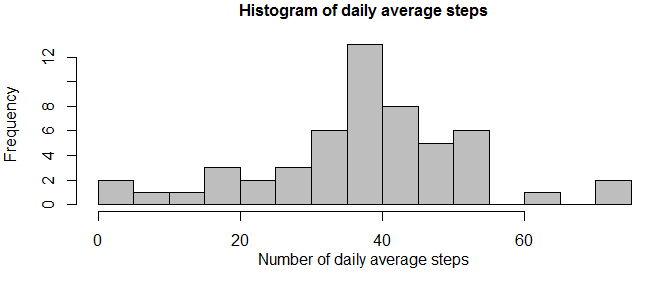
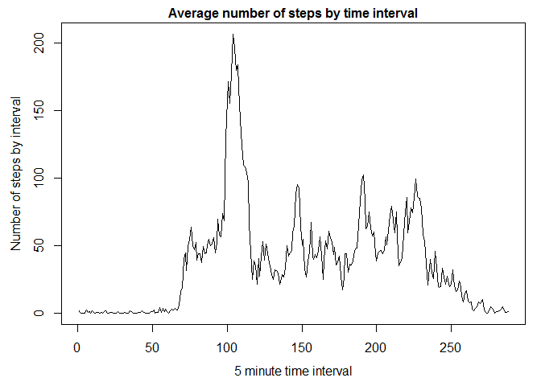
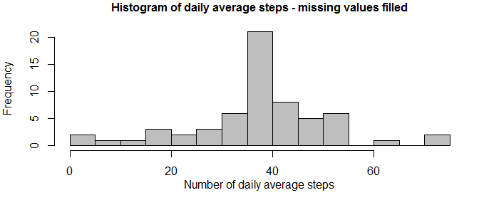
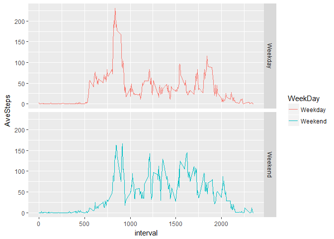

# Reproducible Research: Peer Assessment 1

## Loading and preprocessing the data

The following code was used to download data into an appropriate folder and unzip it. unzip() and read.csv() functions were used.


```r
if(!file.exists("./data")){dir.create("./data")}
unzip(zipfile="activity.zip",exdir="./data")
activity <- read.csv("./data/activity.csv")
```

Some general information can be extracted from activity data using using str() and summary() functions.


```r
str(activity)
```

```
## 'data.frame':	17568 obs. of  3 variables:
##  $ steps   : int  NA NA NA NA NA NA NA NA NA NA ...
##  $ date    : Factor w/ 61 levels "2012-10-01","2012-10-02",..: 1 1 1 1 1 1 1 1 1 1 ...
##  $ interval: int  0 5 10 15 20 25 30 35 40 45 ...
```


```r
summary(activity$steps)
```

```
##    Min. 1st Qu.  Median    Mean 3rd Qu.    Max.    NA's 
##    0.00    0.00    0.00   37.38   12.00  806.00    2304
```

The variables included in this dataset are:

 * steps: Number of steps taking in a 5-minute interval. It is an integer variable, with a number of missing values coded as NA. It ranges from 0 to 806 steps per 5 minute interval.
 * date: The date on which the measurement was taken in YYYY-MM-DD format.
 * interval: Identifier for the 5-minute interval in which measurement was taken.


## What is mean total number of steps taken per day?

For this part of the assignment, missing values in the dataset were ignored and some statistics were calculated:  

 1. Calculate the total number of steps taken per day

tapply() function is a good option here. The average value of steps taken in the first 10 days of the experiment are printed belo to see some results.


```r
DailyMean <- tapply(activity$steps, activity$date, mean, na.rm = TRUE)
head(DailyMean, 10)
```

```
## 2012-10-01 2012-10-02 2012-10-03 2012-10-04 2012-10-05 2012-10-06 
##        NaN    0.43750   39.41667   42.06944   46.15972   53.54167 
## 2012-10-07 2012-10-08 2012-10-09 2012-10-10 
##   38.24653        NaN   44.48264   34.37500
```

 2. Make a histogram of the total number of steps taken each day  

The histogram was built using hist() function. Labels and titles were added to the graphic. The number of breaks was also modified in order to have a better idea of skewness. The histogram seems to be approximately symetrical with higher concentration of number of steps between 35 and 40 steps per 5-minute interval.


```r
par(mar = c(4,4,2,1))
hist(DailyMean, main = "", xlab = "", col = "grey", breaks = 15)
mtext("Histogram of daily average steps", side = 3, line = 1, font = 2)
mtext("Number of daily average steps", side = 1, line = 2)
```

<!-- -->
 
 3. Calculate and report the mean and median of the total number of steps taken per day


```r
Mean <- mean(DailyMean, na.rm = TRUE)
Median <- median(DailyMean, na.rm = TRUE)
```

The mean value of steps taken per day is 37.383 and its median is 37.378.

## What is the average daily activity pattern?

 1. Make a time series plot (i.e. type = "l") of the 5-minute interval (x-axis) and the average number of steps taken, averaged across all days (y-axis)


```r
IntervalAve <- tapply(activity$steps, activity$interval, mean, na.rm = TRUE)
par(mar = c(4,4,1.5,1))
plot(c(1:288), IntervalAve, type = "l",
                       main = "", ylab = "", xlab = "")
mtext("Average number of steps by time interval", side = 3, line = 0.2, font = 2)
mtext("Number of steps by interval", side = 2, line = 2.5)
mtext("5 minute time interval", side = 1, line = 2.5)
```

<!-- -->


 2. Which 5-minute interval, on average across all the days in the dataset, contains the maximum number of steps?

```r
Max <- max(IntervalAve)
MaxInt <- which.max(IntervalAve)
```

The interval that on average contains maximum number of steps is the 104th interval, which correspondes to 835 am. In this time interval, 206.2 steps are taken on average.

## Imputing missing values

Note that there are a number of days/intervals where there are missing values (coded as NA). The presence of missing days may introduce bias into some calculations or summaries of the data.

 1. Calculate and report the total number of missing values in the dataset (i.e. the total number of rows with NAs)


```r
NAnumber <- sum(is.na(activity$steps))
```

The total number of missing values is 2304.

 2. Devise a strategy for filling in all of the missing values in the dataset. The strategy does not need to be sophisticated. For example, you could use the mean/median for that day, or the mean for that 5-minute interval, etc.

The strategy to fill the missing values in the data set is to use the average value of the correspondent 5-minute interval. The average value is rounded using round() function, with zero decimal places. The "InvtervalAve" array was used here and the replacement is done using ifelse() function.


```r
IntervalAveSub <- round(IntervalAve,0)
Steps <- ifelse(is.na(activity$steps), IntervalAveSub, activity$steps)
```

  3. Create a new dataset that is equal to the original dataset but with the missing data filled in.

"Steps" dataset was created with all missing values filled.


```r
Steps <- cbind(Steps, activity[,2:3])
write.csv(Steps,"./data/activity2.csv")
```

 4. Make a histogram of the total number of steps taken each day and Calculate and report the mean and median total number of steps taken per day. Do these values differ from the estimates from the first part of the assignment? What is the impact of imputing missing data on the estimates of the total daily number of steps?


```r
DailyAve2 <- tapply(Steps$Steps, Steps$date, mean, na.rm = TRUE)
head(DailyAve2, 10)
```

```
## 2012-10-01 2012-10-02 2012-10-03 2012-10-04 2012-10-05 2012-10-06 
##   37.36806    0.43750   39.41667   42.06944   46.15972   53.54167 
## 2012-10-07 2012-10-08 2012-10-09 2012-10-10 
##   38.24653   37.36806   44.48264   34.37500
```

```r
par(mar = c(4,4,2,1))
hist(DailyAve2, main = "", xlab = "", col = "grey", breaks = 15)
mtext("Histogram of daily average steps - missing values filled", side = 3, line = 1, font = 2)
mtext("Number of daily average steps", side = 1, line = 2)
```

<!-- -->

```r
Mean2 <- mean(DailyAve2, na.rm = TRUE)
Median2 <- median(DailyAve2, na.rm = TRUE)
```

There wasn't any significant change between the histograms. And the same thing happened with mean and median values. The mean value of steps taken per day in original data set was 37.383 and its median 37.378. After filling missing values, the mean and median was recalculated to 37.381 and 37.368, respectively.

Despite of that, the importance of imputing missing data is related to the fact that some statistical methods can't habdle missing values, for example, Principal Components Analysis or Time Series Analysis. That's why this imputing is necessary in some cases.

## Are there differences in activity patterns between weekdays and weekends?

 1. Create a new factor variable in the dataset with two levels - "weekday" and "weekend" indicating whether a given date is a weekday or weekend day.
 
Two R Packages were used here: "plyr" and "chron". "plyr" package was loaded so mutate() and ddply() function could be use. The first one adds "WeekDay" column to Steps data frame. ddply helps summarise the data in the second step of weekends analysis. "chron" package was used to obtain more easily weekend information.


```r
library(plyr)
library(chron)
Steps <- mutate(Steps, "WeekDay" = ifelse(is.weekend(as.Date(date)),
                                   "Weekend","Weekday"))
```

 2. Make a panel plot containing a time series plot (i.e. type = "l") of the 5-minute interval (x-axis) and the average number of steps taken, averaged across all weekday days or weekend days (y-axis).

Panel plot was made using "ggplot2" package. The plot was built using diferent colours and separate panels.


```r
Steps2 <- ddply(Steps, .(WeekDay, interval),
                summarise, AveSteps = mean(Steps))
library(ggplot2)
q <- ggplot(Steps2, aes(interval, y = AveSteps))
q + geom_line(aes(colour = WeekDay)) + facet_grid(WeekDay ~ .)
```

<!-- -->

By these plots one can conclude that major difference between weekdays and weedend days happens in the morning hours. Fewer steps are taken mostly between 05:30 am and 07:30 am. Also the pick that during weekdays occur around 08:30am (over 250 steps) is smaller during weekends (less than 175 steps on average).

Also there is a slight tendence of reducing the activity a bit latter during weekends. In these days, there's some activity until 08:00pm while on weekdays the activity is reduced after 7:00pm. Another thing that might be observed is that on weekends there's a bigger oscilation of steps during the day, from 10:00am to 08:00pm.
